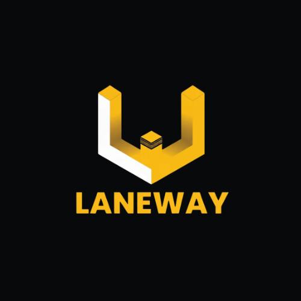

<div align="center">
  
</div>

# Laneway India — Agency Website

Welcome to the Laneway India monorepo! This project contains the public-facing Agency Website. 

## 🏗️ Project Architecture Overview

This project is a modern full-stack web application built using a monorepo structure.

- **Frontend (`/`)**: Next.js 16 (App Router), React 19, TailwindCSS v4, Framer Motion, and Radix UI Primitives.
- **Backend (`/backend`)**: Express 5 REST API running on Node.js, acting as the Blog engine.
- **Database**: PostgreSQL (managed via Supabase).
- **Authentication**: Dual-auth system. Supabase Auth (email/password) for the frontend interactions.
- **Media & Storage**: Cloudinary (Image/Asset management) [removed cloudinary] and Upstash Redis (Caching/Rate Limiting).

---

## 🚀 Getting Started (Local Development)

### Prerequisites

Ensure you have the following installed to run the project locally:
- Node.js (v20+ recommended)
- `pnpm`
- A PostgreSQL instance (or a Supabase project)
- Cloudinary, Hostinger SMTP, and Upstash Redis credentials

### 1. Installation

Install dependencies for both the frontend and the backend.

```bash
# Install frontend dependencies (from root)
pnpm install

# Install backend dependencies
cd backend
npm install
```

### 2. Environment Variables Integration

This project uses a unified environment approach where the backend parses and serves public keys to the frontend.

1. **Backend Environment Setup:**
   Copy `backend/.env.example` to `backend/.env` (or set up `.env` at the root folder depending on deployment routing) and fill in the values:
   - Supabase keys (`SUPABASE_URL`, `SUPABASE_ANON_KEY`, `SUPABASE_SERVICE_ROLE_KEY`)
   - Database Connection (`DATABASE_URL`, `DB_HOST`, `DB_PORT`, etc.)
   - Cloudinary & Upstash Redis configs
   - JWT Secrets & SMTP Email configs
   
2. *Note on `env.ts`:* The backend explicitly reads from `backend/.env` (or `../../.env` relative to its config module) and serves public variables via the `/api/public-env` endpoint, ensuring the frontend inherits the correct keys dynamically.

### 3. Database Initialization

Navigate to the `backend` directory and run migrations to set up the DB schemas (Users, Leads, Interactions, Blogs, etc.):

```bash
cd backend
npm run migrate

# (Optional) Seed the database with initial users/roles
npm run seed
```

### 4. Running the Application Locally

You will need two separate terminal windows—one for the backend API and one for the frontend Next.js server.

**Terminal 1: Start Backend (Port 5000)**
```bash
cd backend
npm run dev
```

**Terminal 2: Start Frontend (Port 3000)**
```bash
pnpm dev
```

The application will be accessible at `http://localhost:3000/`.

---

## 🛠️ Developer Guide: How to Edit and Update

For future developers onboarding onto the project, follow these guidelines to update features seamlessly:

### Adding or Modifying UI/Pages
- **Routes & Pages**: All frontend pages live inside the `app/` directory according to App Router conventions. To create a new page, make a new folder with a `page.tsx`. Example: `/app/about-us/page.tsx`.
- **Reusable Components**: Placed in the `components/` path. Use `components/ui/` for low-level foundational standard components (Radix primitives) and feature-specific folders, such as `components/home/`, for composite blocks.
- **Styling**: Changes to the global Design System (colors, fonts, glass effects) should happen in `app/globals.css`. It uses Tailwind CSS v4 variables syntax.

### Adding New API Endpoints
- **Frontend Server Actions / Edge APIs**: Quick frontend-only APIs (like form handlers) can be added in `app/api/`.
- **Backend Features (OutreachDesk CRM)**: Add new modules in `backend/src/modules/`. Typically this involves making a `.controller.ts`, `.service.ts`, `.routes.ts`, and `.validation.ts` schema (using Zod). 
- Always ensure you mount new routes in `backend/src/app.ts`.

### Updating the Database Schema
1. Create a new migration file inside `backend/src/database/migrations/` (e.g., `003_new_feature.ts`).
2. Export your `up(pool)` and `down(pool)` async functions.
3. Run `npm run migrate` in the `backend/` folder to propagate the schema change.

### Theming and UI Toolkit
The website heavily relies on **Glassmorphism**, dark layouts (`#050505` background), and gold accents. Whenever you add new UI components:
- Utilize CSS classes `.glass-card` and `.text-gradient` from `globals.css` if necessary.
- Ensure any interactions scale well from mobile (`use-mobile.ts`) upward avoiding heavy DOM mutations blocking animations. GSAP and Framer Motion (`<motion.div>`) should handle complex entrance/exit workflows.

### Adding New Environment Variables
If you need a new API key:
1. Add it to `backend/.env`.
2. Add the variable mapping / validation to `env` exported from `backend/src/config/env.ts`.
3. If the variable also needs to be exposed to the browser (e.g., a new analytics tag), expose it in the `public` node of `env.ts` so the frontend fetches it via `lib/env.ts` dynamically.

---

## 🔒 Security Practices & Notes
- Use Supabase's `getSupabase()` asynchronous setup when dealing with Client components making API calls.
- DO NOT expose Service Role Keys (`SUPABASE_SERVICE_ROLE_KEY`) to the frontend.
- API endpoints are heavily Rate-Limited and structured. Refer to `lib/security.ts` to manage or whitelist specific traffic.

### 🛡️ Recommendations for Enhanced Security
For future iterations, consider implementing the following to further harden the application:
1. **Distributed Rate Limiting:** Migrate the current in-memory rate limiter (`lib/security.ts`) to Upstash Redis. The in-memory map does not persist across Vercel serverless function invocations and multiple instances.
2. **Content Security Policy (CSP):** Add strict CSP headers inside `next.config.mjs` to block unauthorized scripts and prevent XSS effectively alongside the current `Helmet` configs in the backend.
3. **Automated Vulnerability Scanning:** Integrate tools like Snyk or GitHub Dependabot in the CI/CD pipeline to continuously monitor dependencies for known vulnerabilities.
4. **Database Backups and Pooling:** Ensure automated backups are configured within your Supabase project. Also, consider turning on PgBouncer (Supabase connection pooling) to handle sudden spikes in API requests safely.

---

## ⚡ Recommendations for Better Performance

To ensure the website remains lightning-fast and scores high on Core Web Vitals, future developers should tackle the following:

1. **Optimize Large Media Assets (High Priority):** 
   - The hero illustration `1.svg` (currently ~33.9 MB) severely impacts the initial page load time. It MUST be optimized, converted to WebP, compressed, or switched to a lightweight Lottie animation (`.json`).
2. **Externalize Chatbot Knowledge Base:** 
   - The current Chatbot (`chatbot.tsx`) uses a hardcoded knowledge base string. Moving this to the PostgreSQL database or a headless CMS will significantly reduce the client-side JavaScript bundle size.
3. **SMTP Email Queueing:** 
   - Operations like sending emails via Hostinger SMTP are currently synchronous. Implementing an asynchronous task queue (e.g., using BullMQ with Redis) will ensure API requests resolve immediately without waiting on slow third-party email servers.
4. **Automated Testing:** 
   - Protect performance and UX from regressions by introducing End-to-End (E2E) testing frameworks like Cypress or Playwright. Currently, no automated tests exist.
5. **Edge Caching:** 
   - Leverage Vercel's caching rules and ISR (Incremental Static Regeneration) for the blogs platform to serve pages near-instantly directly from the Edge network without repeatedly taxing the backend Express API.
